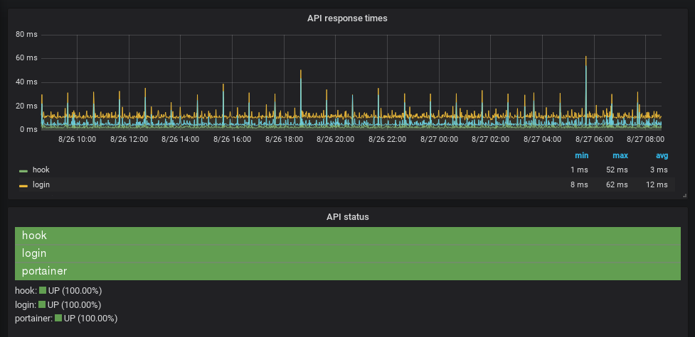

# apimon

[](https://travis-ci.org/ncarlier/apimon)
[](https://microbadger.com/images/ncarlier/apimon)
[](https://hub.docker.com/r/ncarlier/apimon/)

APImon is a simple tool to monitor HTTP endpoints and send metrics to a
robust monitoring platform (such as TICK, Prometheus, ELK, etc.).


## Installation

Run the following command:

```bash
$ go get -v github.com/ncarlier/apimon
```

**Or** download the binary regarding your architecture:

```bash
$ sudo curl -s https://raw.githubusercontent.com/ncarlier/apimon/master/install.sh | bash
```

**Or** use Docker:

```bash
$ docker run -d --name=apimon \
  -v ${PWD}/configuration.yml:/etc/apimon.yml \
  ncarlier/apimon apimon -c /etc/apimon.yml
```

## Configuration

The configuration is a YAML file structured like this:

```yaml
output:            # Output configuration
  traget: stdout   # By default "stdout"
  format: influxdb # By default "influxdb"
proxy: http://proxy-internet.localnet:3128 # Global HTTP proxy to use. By default none
healthcheck:            # Global healthcheck configuration
  interval: 5s          # By default 30s
  timeout: 2s           # By default 5s
  rules:                # By default "code: 200"
    - name: code
      spec: 200-299
monitors: # List of monitors configuration
  - alias: nunux-keeper-api # The name used within the produced metrics. By default the URL
    url: https://api.nunux.org/keeper/ # The URL to monitor
    unsafe: true # Don't check SSL certificate. By default false
    proxy: http://proxy-internet.localnet:3128 # Specific HTTP proxy to use (overide global). By default none
    headers: # HTTP headers to add to the request
      - "X-API-Key: xxx-xxx-xxx"
    healthcheck: # Monitor specific configuration (overide global)
      timeout: 100ms
      rules:
        - name: code
          spec: 200
  - url: https://reader.nunux.org
```

### Output configuration

This configuration section allows you to set the targeted output
(i. e. your monitoring platform).

- `stdout`: Prints metrics to the STDOUT.
- `file://test.log`: Writes metrics to a log file.
- `http://...`:
  - Post metrics to an HTTP endpoint such as [InfluxDb][influxdb],
  [Elasticsearch][elasticsearch], etc. (Push Mode)
  - OR serve metrics on this HTTP endpoint if `prometheus` format is used (Pull mode)

> Note: When you are using `stdout` you should use the logging output flag
> (`-o`) in order to not mix metrics and logs outputs.

You can also choose the output format:

- `influxdb`: [InfluxDb line protocol][influxdb-line-protocol] (when using a
  collector compatible with [InfluxDB][influxdb])
- `json`: JSON format (when using [Elasticsearch][elasticsearch] like solution)
- `prometheus`: when using [Prometheus][prometheus] as collector

> Note: When using `prometheus` format the output configuration must be a local
> HTTP endpoint.
> This endpoint will be mounted by APImon and you will be able to
> [configure](./prometheus.yml) Prometheus to scrap this target.

### Healthcheck configuration

You can configure the health check in a global way (for all monitors) by placing
this section at the root level of the configuration file.
If you configure the health check of a specific monitor, the configuration
applies upon the global one.

A health check is defined like this:

- `interval`: the waiting time between checks
- `timeout`: the maximum time allowed for a check
- `rules`: the list of validation rules

A rule have the following structure:

- `name`: rule name
- `spec`: rule specification

The `name` selects the validator to be applied.
And `spec` is the configuration of the validator.

Validators are chained (using list order).
The first failed validator stops the validation chain and the monitor is
considered as DOWN.

### Available validators

Name   | Spec 
-------|------
`code` | Validates status code (ex: `200`)<br>Validates status code in a list (ex: `200,204,205`)<br>Validates status code within an interval (ex: `200-204`)
`json-path` | Validates JSON response with a [JSON path][jsonpath-syntax] expression (ex: `$.service[?(@.status == 'UP')]`)
`json-expr` | Validates JSON response with an [expression][expr-syntax] (ex: `service.status == "UP" && uptime < 100)]`)
`regexp` | Validates body response with a [regular expression][regexp-syntax] (ex: `^ok$`)
`cert` | Validates certificate expiration date is before N days (ex: `30`)

## Usage

Type `apimon -help` to get the usage.

Basically, all you have to do is to provide the configuration file either using
the `-c` parameter or the standard input of the command.

Here come examples of possible usages:

```bash
$ # Using the defaul configuration file: `./configuration.yml`
$ apimon
$ # Using a specific configuration file
$ apimon -c /etc/apimon.yml
$ # Using a configuration file provided by the shell standard input
$ cat conf.yml | apimon
$ ...
```

Here an example of a Grafana dashboard displaying metrics form APImon:



## FAQ

### I am using InfluxDB with UDP

This is why `stdout` output is designed.
You can pipe the standard output to `netcat`:

```bash
$ # Sending metrics to InfluxDb using UDP
$ cat conf.yml | apimon -o output.log | nc -C -w 1 -u localhost 8125
```

### I am using Elasticsearch

You can either send the metrics (using JSON format as output configuration!)
directly to Elasticsearch:

```bash
$ apimon -c config.yml -o output.log | curl -X POST - -d @- http://localhost:9200/index/doc
$ # You can also directly use the HTTP output provider into the APIMon configuration
```

or better: use [Logstash][logstash] to collect the JSON outputs:

```
input {
  pipe {
    type => "apimon"
    debug => true
    command => "/usr/local/apimon -c /etc/apimon.yml -o /var/log/apimon.log"
  }
}
```
---

This software is under MIT License (MIT)

Copyright (c) 2018 Nicolas Carlier

Permission is hereby granted, free of charge, to any person obtaining a copy
of this software and associated documentation files (the "Software"), to deal
in the Software without restriction, including without limitation the rights
to use, copy, modify, merge, publish, distribute, sublicense, and/or sell
copies of the Software, and to permit persons to whom the Software is
furnished to do so, subject to the following conditions:

The above copyright notice and this permission notice shall be included in all
copies or substantial portions of the Software.

THE SOFTWARE IS PROVIDED "AS IS", WITHOUT WARRANTY OF ANY KIND, EXPRESS OR
IMPLIED, INCLUDING BUT NOT LIMITED TO THE WARRANTIES OF MERCHANTABILITY,
FITNESS FOR A PARTICULAR PURPOSE AND NONINFRINGEMENT. IN NO EVENT SHALL THE
AUTHORS OR COPYRIGHT HOLDERS BE LIABLE FOR ANY CLAIM, DAMAGES OR OTHER
LIABILITY, WHETHER IN AN ACTION OF CONTRACT, TORT OR OTHERWISE, ARISING FROM,
OUT OF OR IN CONNECTION WITH THE SOFTWARE OR THE USE OR OTHER DEALINGS IN THE
SOFTWARE.

[elasticsearch]: https://www.elastic.co/products/elasticsearch
[logstash]: https://www.elastic.co/products/logstash
[influxdb]: https://github.com/influxdata/influxdb
[influxdb-line-protocol]: https://docs.influxdata.com/influxdb/v1.4/write_protocols/line_protocol_tutorial/
[prometheus]: https://prometheus.io/
[regexp-syntax]: https://golang.org/pkg/regexp/syntax/
[expr-syntax]: https://github.com/antonmedv/expr/wiki/The-Expression-Syntax
[jsonpath-syntax]: http://goessner.net/articles/JsonPath/index.html
